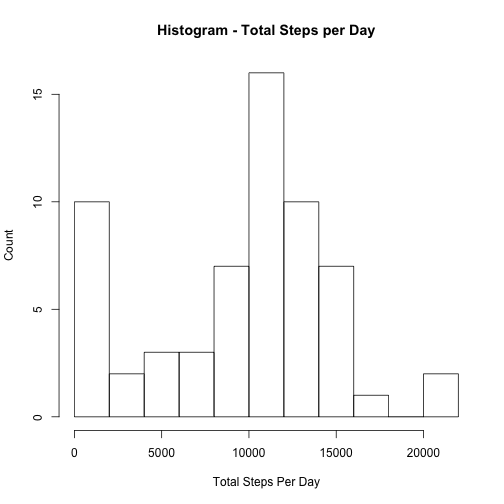
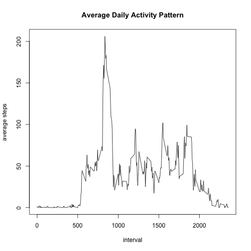
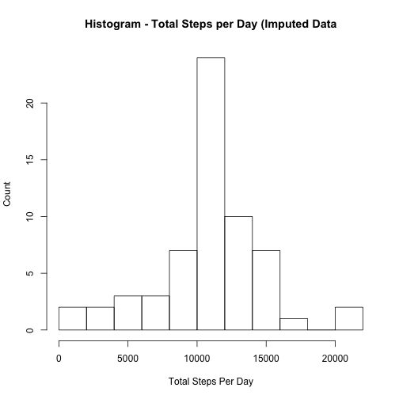
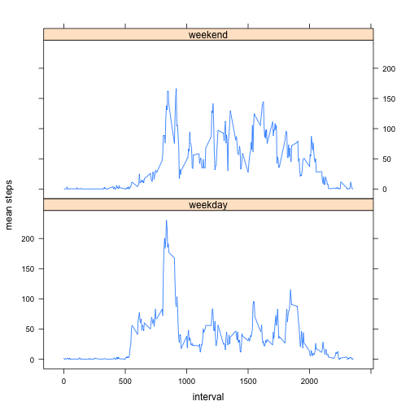

## Loading and preprocessing the data

```r
library('dplyr',quietly=TRUE, verbose=FALSE,warn.conflicts=FALSE)
```


```r
if(!file.exists("./activity.csv")) {
    unzip("./activity.zip")
}
movedata <- read.csv('./activity.csv')
```


## What is mean total number of steps taken per day?

```r
by_day <- group_by(movedata,date)
day_totals <- summarise(by_day, total_steps=sum(steps,na.rm=TRUE))
```

Histogram - Steps Per Day


```r
hist(day_totals$total_steps,freq=7,breaks=11, xlab='Total Steps Per Day',ylab='Count',main='Histogram - Total Steps per Day')
```

 

Mean Total Steps per Day

```r
mean(day_totals$total_steps)
```

```
## [1] 9354.23
```

Median Total Steps Per Day

```r
median(day_totals$total_steps)
```

```
## [1] 10395
```


## What is the average daily activity pattern?


```r
by_int <- group_by(movedata,interval)
interval_avg = summarize(by_int, mean_steps=mean(steps, na.rm=TRUE))
plot(interval_avg,type='l',xlab='interval',ylab='average steps',main='Average Daily Activity Pattern')
```

 

The 5-minute interval, on average across all days in the dataset, with the max number of steps:

```r
filter(interval_avg, mean_steps == max(interval_avg$mean_steps))$interval
```

```
## [1] 835
```


## Imputing missing values

Data set rows with missing values:


```r
length(subset(movedata,is.na(movedata$steps))$steps)
```

```
## [1] 2304
```

Replace missing values with the average value for the interval, computed from the non-missing values.


```r
md2 <- movedata
for(i in 1:dim(md2)[1]) {
  if(is.na(md2[i,1])) {
    imputed <- subset(interval_avg, interval == md2[i,3])[2]
    md2[i,1] <- imputed
  }
}
```

Histogram - Steps Per Day with Imputed Values


```r
by_day <- group_by(md2,date)
day_totals <- summarise(by_day, total_steps=sum(steps,na.rm=TRUE))

hist(day_totals$total_steps,freq=7,breaks=11, xlab='Total Steps Per Day',ylab='Count',main='Histogram - Total Steps per Day (Imputed Data')
```

 

Mean Total Steps per Day with Imputed Values

```r
mean(day_totals$total_steps)
```

```
## [1] 10766.19
```

Median Total Steps Per Day with Imputed Values

```r
median(day_totals$total_steps)
```

```
## [1] 10766.19
```

## Are there differences in activity patterns between weekdays and weekends?

First we need to determine the day of week associated with each date. Note
we use the data set with imputed values as described above.

```r
library('lubridate',quietly=TRUE, verbose=FALSE,warn.conflicts=FALSE)
md2$date <- ymd(as.character(md2$date))
md2$dayofweek <- weekdays(md2$date)
```

Now we can label days as being weekdays or weekend days, after which we can
compare weekend activity with weekday activity.

```r
weekday <- function(day) {
  day != "Saturday" & day != "Sunday"
}

md2$weekday <- weekday(md2$dayofweek)
md2$weekday <- factor(md2$weekday, labels=c("weekend","weekday"))
```

Weekend vs Weekday Activity


```r
library('lattice',quietly=TRUE, verbose=FALSE,warn.conflicts=FALSE)

by_int_wd <- group_by(subset(md2, md2$weekday=="weekday"),interval)
interval_avg_wd = summarize(by_int_wd, mean_steps=mean(steps, na.rm=TRUE))
interval_avg_wd$weekday <- "weekday" 

by_int_we <- group_by(subset(md2, md2$weekday=="weekend"),interval)
interval_avg_we = summarize(by_int_we, mean_steps=mean(steps, na.rm=TRUE))
interval_avg_we$weekday <- "weekend"

combined_interval_avg <- rbind(interval_avg_wd, interval_avg_we)
with(combined_interval_avg, xyplot(mean_steps ~ interval|weekday,type='l',
                                   ylab='mean steps',layout=c(1,2)))
```

 


